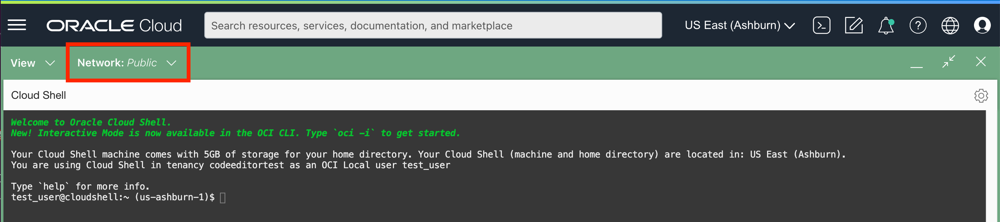
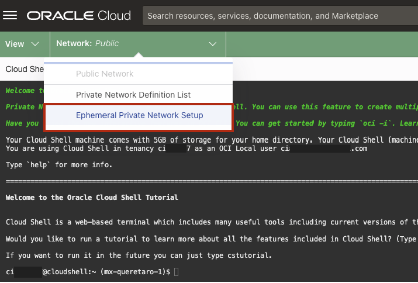
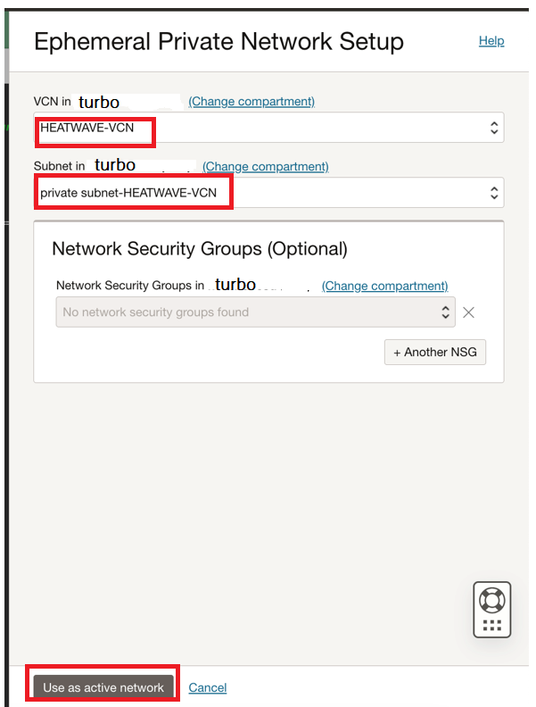
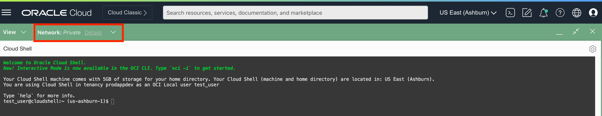
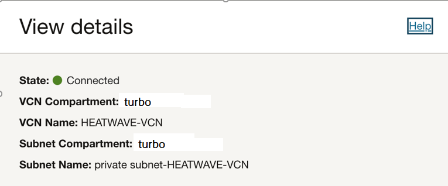
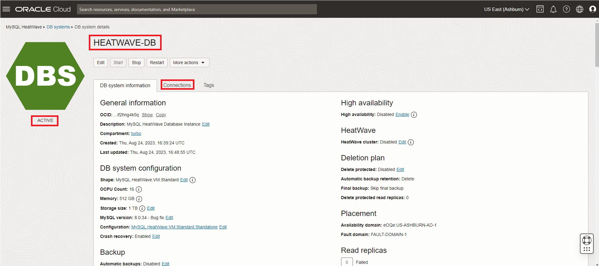
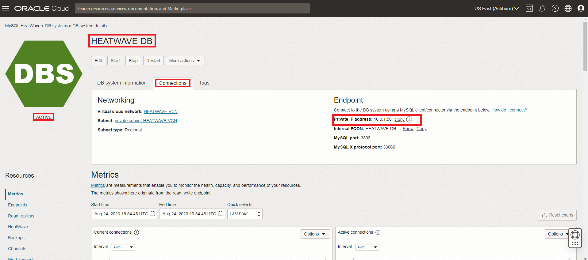

# Connect to MySQL HeatWave With Cloud Shell Private Access and OCI Shell


## Introduction

When working in the cloud, there are often times when your servers and services are not exposed to the public internet. The Oracle Cloud Infrastructure (OCI) MySQL HeatWave is an example of a service that is only accessible through private networks. Since the service is fully managed, we keep it siloed away from the internet to help protect your data from potential attacks and vulnerabilities. It’s a good practice to limit resource exposure as much as possible, but at some point, you’ll likely want to connect to those resources. That’s where Cloud Shell Private Access enters the picture. Cloud Shell Private Access allows you to connect a Cloud Shell session to a private network so you can access  your MySQL HeatWave Database without having the network traffic flow over public networks

_Estimated Lab Time:_ 10 minutes

### Objectives

In this lab, you will be guided through the following tasks:

- Connect to Cloud Shell
- Setup Cloud Shell Private Access
- Use MySQL Shell to Connect to your Heatwave Database
- Load airportdb sample shema data into HeatWave

### Prerequisites

- An Oracle Trial or Paid Cloud Account
- Some Experience with MySQL Shell
- Must Complete Lab 1

## Task 1: Access Cloud Shell via the Console

1. Login to the OCI Console.
2. Click the Cloud Shell icon in the Console header. Note that the OCI CLI running in the Cloud Shell will execute commands against the region selected in the Console's Region selection menu when the Cloud Shell was started.

    

    This displays the Cloud Shell in a "drawer" at the bottom of the console:

    

    You can use the icons in the upper right corner of the Cloud Shell window to minimize, maximize, restart, and close your Cloud Shell session.

## Task 2: Setup Cloud Shell Private Access

1. To change the network your Cloud Shell session is using to the HeatWave Database network, use the drop-down Network menu at the top of the Cloud Shell terminal window:

    

2. Select the Private Network Setup menu item. this will bring up the Private Network Setup panel. This panel allows you to select details for the private network you want to use:

    

3. Select the compartment that you want to use, and then select the VCN and the Subnet to use from the drop-down list boxes. You can also optionally select one or more Network Security groups to use.

    

4. Click on the Connect to this network button to switch your Cloud Shell network connection to the HeatWave Database network.

    Your Cloud Shell session is now connected to your HeatWave private network, as indicated in the Networking drop-down at the top of the Cloud Shell terminal session:

    

    You can see details about your private network connection by clicking the Details link.

    

## Task 3: Load airportdb sample schema data into HeatWave DB

The data loading process involves using MySQL Shell and Object storage to create the airportdb schema and import its data using the MySQL Shell Dump Loading utility. For information about this utility, see Dump Loading Utility: [https://dev.mysql.com/doc/mysql-shell/8.0/en/mysql-shell-utilities-load-dump.htmly](https://dev.mysql.com/doc/mysql-shell/8.0/en/mysql-shell-utilities-load-dump.html)

1. You will use Cloud Shell to connect to HEATWAVE-DB  using the MySQL Shell client tool and the HeatWave system endpoint (private IP Address) .

   The endpoint (IP Address) can be found in your notepad or go to the **HEATWAVE-HW** DB System page

    Click on the OCI Menu > Databases > DB Systems ... and click on your **HEATWAVE-DB** database. When the **HEATWAVE-DB** Page displays, select the **Connections** tab.
      

    Copy the MySQL Endpoint (Private IP Address) to use in the next step.

    

2. Use the following command to connect to MySQL using the MySQL Shell client tool. Be sure to add the **HEATWAVE-DB**  private IP address at the end of the command. Also enter the admin user and the db password created on Lab 1

    (Example  **mysqlsh -uadmin -p -h <private IP address>**)

    **[opc@...]$**

    ```bash
    <copy>mysqlsh -uadmin -p -h 10.0.1... </copy>
    ```

    

3. Load the airportdb database into the MySQL DB System using the MySQL Shell Dump Loading Utility.

    ```bash
    <copy>\js</copy>
    ```

    ```bash
    <copy>util.loadDump("https://objectstorage.us-ashburn-1.oraclecloud.com/p/yXOA3Kwid4uG0oHvHMufbK3cSESmQlU6-0bVB_1vQ8VxR0ggB1m-nDYYOXXy0O5W/n/idazzjlcjqzj/b/airportdb-bucket-112312031/o/airportdb_all/", {progressFile: "progress.json", threads: 16, deferTableIndexes: "all", ignoreVersion: true, loadIndexes:false})</copy>
    ```

    

5. View  the airportdb total records per table

    ```bash
    <copy>\sql</copy>
    ```

    ```bash
    <copy>SELECT table_name, table_rows FROM INFORMATION_SCHEMA.TABLES WHERE TABLE_SCHEMA = 'airportdb';</copy>
    ```

     

6. Exit MySQL Shell

      ```bash
      <copy>\q</copy>
      ```

You may now **proceed to the next lab**

## Acknowledgements

- **Author** - Perside Foster, MySQL Principal Solution Engineering
- **Contributors** - Mandy Pang, MySQL Principal Product Manager,  Nick Mader, MySQL Global Channel Enablement & Strategy Manager
- **Last Updated By/Date** - Perside Foster, MySQL Solution Engineering, August 2023