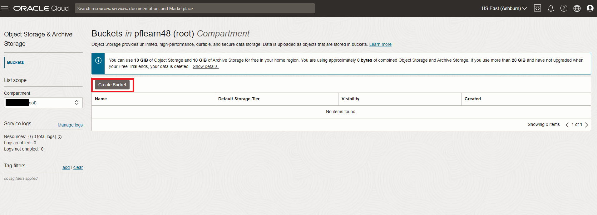
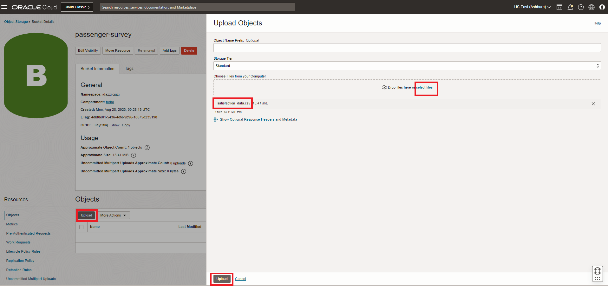
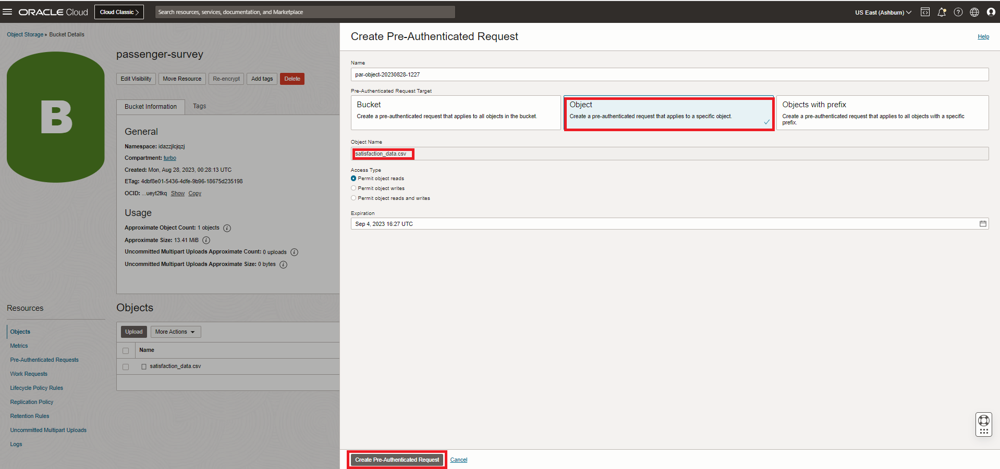
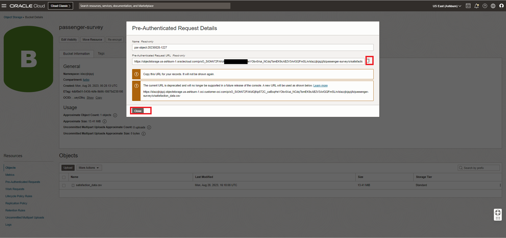

# Do HeatWave Lakehouse


## Introduction

MySQL HeatWave includes MySQL HeatWave Lakehouse, letting users query hundreds of terabytes of data in object storage—in a variety of file formats, such as CSV, Parquet, and Aurora/Redshift export files from other databases. Customers can query transactional data in MySQL databases, data in various formats in object storage, or a combination of both using standard MySQL commands. Querying data in object storage is as fast as querying data inside the database.

### Objectives

In this lab, you will be guided through the following tasks:

- Create Object Storage bucket
- Upload survey data
- Create PAR Link for the  survey file
- Run Autoload to infer the schema and estimate capacity
- Load survey table from Object Store into MySQL HeatWave cluster

### Prerequisites

- An Oracle Trial or Paid Cloud Account
- Some Experience with MySQL Shell
- Completed Lab 4

## Task 1: Download survey file to your local machine

1. From Windows,linux, or mac Local machine click  this  link to download the sample file to your local machine

    [airline\_passenger\_satisfaction.csv:](https://objectstorage.us-ashburn-1.oraclecloud.com/p/aiWCG75BKt3kjlZ6_R-JUoXG1gdzk1uhetAXXBrmvBaDLDYpsLIOl28ZYEyQTUY3/n/mysqlpm/b/mysql_airport/o/airline_passenger_satisfaction.csv
) 

## Task 2: Create Object Storage bucket

1. Sign in to OCI using your tenant name, user name and password.
2. Once signed in select the **turbo** compartment
3. From the Console navigation menu, click **Storage**.
4. Under Object Storage, click Buckets

    **NOTE:** Ensure the correct Compartment is selected : Select **turbo**

    

5. Click Create Bucket. The Create Bucket pane is displayed.
6. Enter a Bucket Name **passenger-survey**
7. Under Default Storage Tier, click Standard. Leave all the other fields at their default values.
8. Click Create

    

## Task 3: Upload passenger survey data

1. In the Buckets page, click the **passenger-survey** name to load images into. The bucket's details page is displayed.
2. Under Resources, click Objects to display the list of objects in the bucket.
3. Click Upload. The Upload Objects pane is displayed.
4. Select the "airline\_passenger\_satisfaction.csv" file from the local folder
    - Click open to load the "airline\_passenger\_satisfaction.csv"  file
    - Click the Upload button
       

    - Wait for the **Abort** to change into **close**
    - Click the **close** button

## Task 4: Create the PAR Link for the "airline\_passenger\_satisfaction" files

1. To create a PAR URL
    - Go to menu **Storage —> Buckets**
     

    - Select **airport-survey**  folder.
2. Select the first file —> **airline\_passenger\_satisfaction.csv** and click the three vertical dots.
3. Click on **Create Pre-Authenticated Request**

    

4. The **Object** option will be pre-selected.
5. Keep **Permit object reads** selected
6. Kep the other options for **Access Type** unchanged.
7. Click the **Create Pre-Authenticated Request** button.

    

8. Click the **Copy** icon to copy the PAR URL.
    

9. Save the generated PAR URL; you will need it in the next task

## Task 5: Add passenger-survey data to HeatWave Lakehouse

1. Connect to MySQL using the MySQL Shell client tool with the following command:

    ```bash
    <copy>mysqlsh -uadmin -p -h 10.0.1... --sql </copy>
    ```

    

2. List the schemas in your heatwave instance

    ```bash
    <copy>show databases;</copy>
    ```

    

3. Change to the airportdb database

    Enter the following command at the prompt

    ```bash
    <copy>USE airportdb;</copy>
    ```

4. Define the External Table to access the passenger\_survey data. First modify the command with the saved Pre-Authenticated Request as indicated. Then, execute it.

    Enter the following command at the prompt

    ```bash
    <copy>CREATE TABLE `airportdb`.`passenger_survey`(
  `id` int NOT  NULL,
  `satisfaction_v2` text,
  `Gender` text,
  `Customer_Type` text,
  `Age` int  NOT  NULL,
  `Type_of_Travel` text,
  `Class` text,
  `Flight_Distance` int  NOT  NULL,
  `Seat_comfort` int  NOT  NULL,
  `Departure_Arrival_time_convenient` int NOT  NULL,
  `Food_and_drink` int  NOT  NULL,
  `Gate_location` int  NOT  NULL,
  `Inflight_wifi_service` int NOT  NULL,
  `Inflight_entertainment` int  NOT  NULL,
  `Online_support` int  NOT  NULL,
  `Ease_of_Online_booking` int  NOT  NULL,
  `On_board_service` int  NOT  NULL,
  `Leg_room_service` int  NOT  NULL,
  `Baggage_handling` int  NOT  NULL,
  `Checkin_service` int  NOT  NULL,
  `Cleanliness` int  NOT  NULL,
  `Online_boarding` int NOT  NULL,
  `Departure_Delay_in_Minutes` int  NOT  NULL,
  `Arrival_Delay_in_Minutes` int  NOT  NULL
) ENGINE=lakehouse SECONDARY_ENGINE=rapid ENGINE_ATTRIBUTE='{
"file": [{
    "par": "<Your Pre-Authenticated Request>"
}],
"dialect": {
    "format": "csv",
    "field_delimiter": ",",
    "record_delimiter": "\\n",
            "skip_rows": 1
}
}';</copy>
    ```
5. You will see the following result
 

6. So far HeatWave only knows where to find the data for the External Table.  Instruct HeatWave to start loading the data from the CSV file.

    ```bash
    <copy>ALTER TABLE `airportdb`.`passenger_survey` SECONDARY_LOAD;</copy>
    ```

7. Check the number of rows loaded into the table.

    ```bash
    <copy>select count(*) from passenger_survey;</copy>
    ```

8. View a sample of the data in Lakehouse.

    ```bash
    <copy>select id, satisfaction_v2, Gender, Customer_Type  from passenger_survey limit 5;</copy>
    ```

You may now **proceed to the next lab**

## Acknowledgements

- **Author** - Perside Foster, MySQL Solution Engineering

- **Contributors** - Abhinav Agarwal, Senior Principal Product Manager, Nick Mader, MySQL Global Channel Enablement & Strategy Manager
- **Last Updated By/Date** - Perside Foster, MySQL Solution Engineering, May 2023
