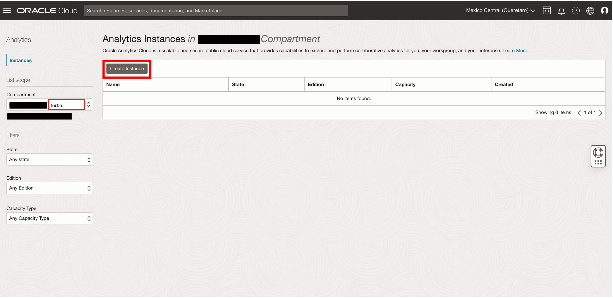
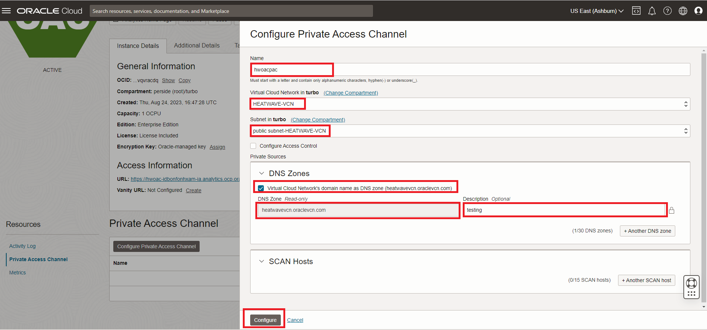
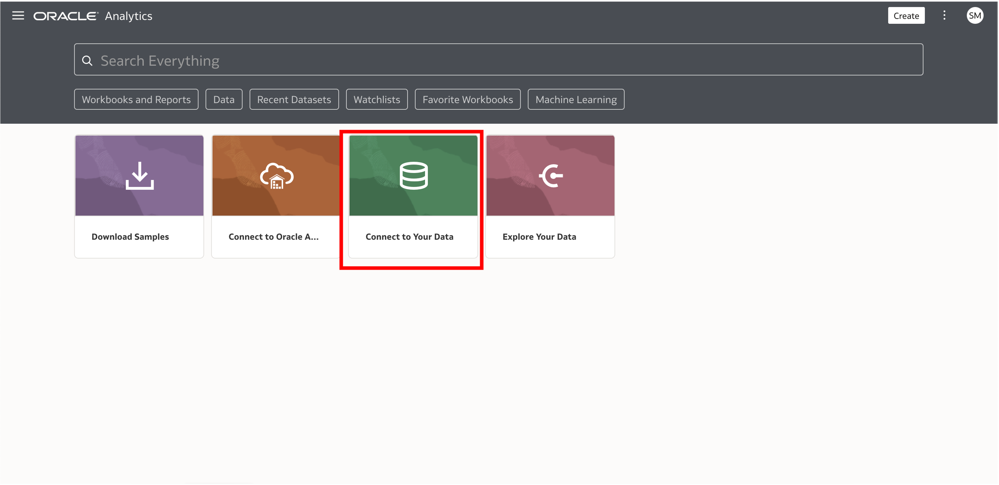

# Build a real-time dashboard in Oracle Analytics Cloud with MySQL HeatWave


## Introduction

MySQL HeatWave can easily be used for development tasks with existing Oracle services, such as Oracle Cloud Analytics. -> Oracle Analytics Cloud (OAC) provides the industry’s most comprehensive cloud analytics in a single unified platform, including self-service visualization and inline data preparation to enterprise reporting, advanced analytics, and self-learning analytics that deliver proactive insights.

Use MySQL HeatWave with OAC to explore and perform collaborative analytics with your MySQL data.

_Estimated Lab Time:_ 20 minutes

### Objectives

In this lab, you will be guided through the following tasks:

- Create Oracle Analytics Cloud and connect to MySQL HeatWave
- Create a dashboard on OAC for the airportdb

### Prerequisites

- An Oracle Trial or Paid Cloud Account
- Some Experience with MySQL Shell
- Completed Lab 4

## Task 1:  Create an Oracle Analytic Cloud Service

1. From the OCI console, navigate to Analytics & AI-> Analytics Clouds

 
 

2. Select the **turbo** Compartment and Click the **Create Instance** button
 

3. On the Create Analytics Instance enter the required information as shown below

    Name:

    ```bash
    <copy>hwoac</copy> 
    ```

    Description:

    ```bash
        <copy>Oracle Analytics Cloud HeatWave Test</copy>
    ```

    Capacity: select **OCPU** and select **1**

    License and Edition: 
    - select **License Included**
    - select **Enterprise Edition**

4. Click the **Create** button

    

5. It takes about 12-15 mins for OAC instance creation to complete.

    

## Task 2: Configure Private Access Channel

1. Go down to the “Private Access Channel” resources page and click on the **Configure Private Access Channel**  button.

2. Click the create Private Access Channel button

3. On the create Private Access Channel page enter the following:

    Name:

    ```bash
         <copy>hwoacpac</copy>
    ```

    DNS Zones:
    **Check Virtual Cloud Network's domain name as DNS zone (hwvcn.oraclevcn.com)**

    Description:

    ```bash
        <copy>Testing</copy>
    ```

    **Remove second  DNS Zone entry**
    
    
4. Click the **Config** button


5. Wait 15 minutes for the process to finish, then continue to Task 3
    

## Task 3: Get HeatWave DB Hostname **

1. Before starting go to Menu Databases > DB Systems

2. Select HeatWave database: HeatWave-DB

3. Click on the "Connections" tab on the Endpoinst > Internal FQDN > Click on the Copy link.

    

4. Save the Hostname, in notepad, for use with OAC

    Example : **hwdb.sub09012.....hwvcn.oraclevcn.com**

## Task 4: - Use OAC to Analyze the Lakehouse passenger-survey data**

1. Navigate to hamburger->Analytics->Analytics Clouds

2. Select the OAC instance you provisioned to access the OAC console by clicking on Analytics Home Page. Click on the "Anlytics Home Page" button.

    

3. Create a Connection to HeatWave to build a dashboard

    
4. Click the "Create Connection" button
    

5. Search for Heatwave and select Heatwave as the database

      

6. Specify the connections details

    - Specify the hostname of HEATWAVE-DB
    - Use the FQDN information you save in Step 3
    - Port: 3306
    - Database Name: airportdb  
    - Be sure to use the Heatwave db user name and password

   Hit the "Save" button to fisnish creating the connection.

    

7. The completed connection will display  a "New Dataset" page. Click on the "Schemas" link and select the "airportdb" schema

    
8. Double click the "passenger\_survey" table. In a few seconds it will display all of the table columns. 

    - Click the "Save" icon to display the "Save Dataset As" dialog box 
    - Set the name and description to "passenge\_survey"
    - click the "OK" button

    

9. Click the "Create workbook" button
    

10. We are only interested in values that can be improved through the booking process. So we will create pie charts to visualize the Satifaction level the following  Services or Results
    - Ease\_of\_Online\_booking and satisfaction\_2
    - Departure\_Arrival\_time\_convenient and satisfaction\_2
    - Departure\_Delay\_in\_Minutes and satisfaction\_2
    - Arrival\_Delay\_in\_Minutes and satisfaction\_2

11. Ease_of\_Online\_booking and satisfaction\_2

    - Click on the satifaction\_v2 value and the Ease_of\_Online\_booking
    - Right click on the Ease_of\_Online\_booking selection anc click "Pick Visualization" option
    - Click on the Pie chart and you will display
    

12. Do the activities in Step 11  for the remaining 3 Data points

    - Departure\_Arrival\_time\_convenient and satisfaction\_2
    - Departure\_Delay\_in\_Minutes and satisfaction\_2
    - Arrival\_Delay\_in\_Minutes and satisfaction\_2

    Your fianl dashboard should look like this:

    

13. Save the workbook as "passenger\_satisfaction".
14. Let's review our charts and determine how they can be used in the booking application to improve customer satisfaction
    - a. Ease of Online booking Satisfaction Level is greater 60% - they're happy let's leave it alone.
    - b. Departure Arrival time convenient - Satisfaction Level is greater 50% let's leave it alone.
    - c. The customer's are very disatisfied with  Departure and Arrival Delays. How can we fix this problem with the booking application.

15. What if we could get data on airline routes and their delays... and what if we cauld find a way to predict fligt delays before the customer made their reservation and provide this information so they could choose flights with less delays? Lab 7 can help make it happen! 

You may now **proceed to the next lab**

## Acknowledgements

- **Author** - Perside Foster, MySQL Principal Solution Engineering
- **Contributors** - Mandy Pang, MySQL Principal Product Manager,  Nick Mader, MySQL Global Channel Enablement & Strategy Manager
- **Last Updated By/Date** - Perside Foster, MySQL Solution Engineering, August 2023